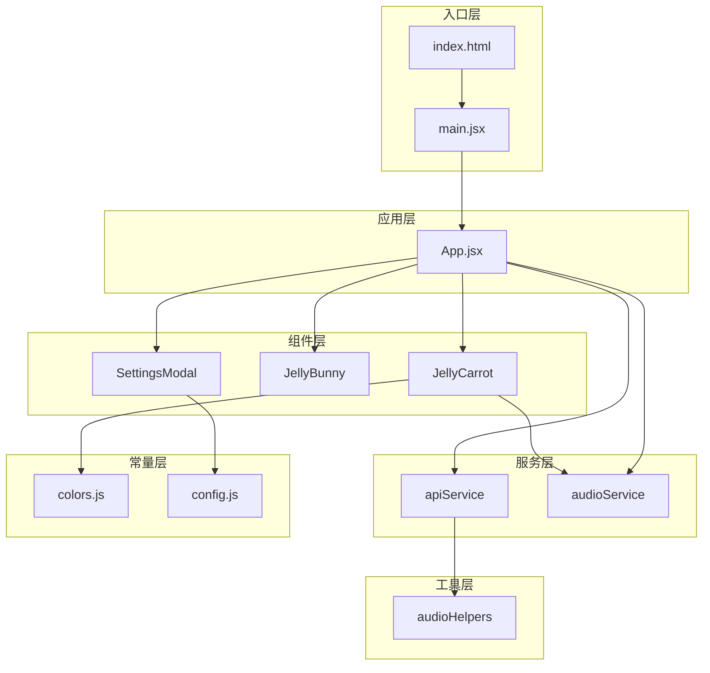

# Design Document: React Project Migration

## Overview

本设计文档描述如何将现有的单文件 React 应用（JellyGarden 拔萝卜游戏）迁移为标准的 Vite + React 项目结构。迁移后的项目将具有清晰的目录结构、模块化的组件和服务层，便于维护和扩展。

## Architecture

### 项目目录结构

```
jelly-garden/
├── index.html              # HTML 入口文件
├── package.json            # 项目依赖配置
├── vite.config.js          # Vite 构建配置
├── tailwind.config.js      # Tailwind CSS 配置
├── postcss.config.js       # PostCSS 配置
└── src/
    ├── main.jsx            # React 应用入口
    ├── index.css           # 全局样式 + Tailwind 指令
    ├── App.jsx             # 主游戏组件
    ├── components/         # UI 组件
    │   ├── JellyCarrot.jsx
    │   ├── JellyBunny.jsx
    │   └── SettingsModal.jsx
    ├── services/           # 业务逻辑服务
    │   ├── apiService.js
    │   └── audioService.js
    ├── utils/              # 工具函数
    │   └── audioHelpers.js
    └── constants/          # 常量配置
        ├── colors.js
        └── config.js
```

### 架构图



## Components and Interfaces

### 1. JellyCarrot 组件

```jsx
// src/components/JellyCarrot.jsx
import { useState } from 'react';
import { motion, AnimatePresence } from 'framer-motion';
import { playSound } from '../services/audioService';
import { CARROT_COLORS } from '../constants/colors';

/**
 * @param {Object} props
 * @param {string} props.color - 萝卜颜色 ('red' | 'blue' | 'yellow' | 'purple')
 * @param {boolean} props.isTarget - 是否为目标萝卜
 * @param {function} props.onClick - 点击回调 (isSuccess: boolean, color: string) => void
 */
export function JellyCarrot({ color, isTarget, onClick }) {
  // 状态: 'planted' | 'pulling' | 'popped' | 'morphing'
  const [status, setStatus] = useState('planted');
  // ... 组件实现
}
```

### 2. JellyBunny 组件

```jsx
// src/components/JellyBunny.jsx
import { motion, AnimatePresence } from 'framer-motion';

/**
 * @param {Object} props
 * @param {string} props.emotion - 表情状态 ('idle' | 'happy' | 'shock')
 * @param {string} props.text - 对话文本
 * @param {boolean} props.isThinking - 是否显示思考动画
 */
export function JellyBunny({ emotion, text, isThinking }) {
  // ... 组件实现
}
```

### 3. SettingsModal 组件

```jsx
// src/components/SettingsModal.jsx
import { motion } from 'framer-motion';
import { LucideSettings, LucideX, LucideKey, LucideGlobe, LucideBot } from 'lucide-react';

/**
 * @param {Object} props
 * @param {boolean} props.isOpen - 是否显示弹窗
 * @param {function} props.onClose - 关闭回调
 * @param {Object} props.config - API 配置对象
 * @param {function} props.setConfig - 配置更新函数
 */
export function SettingsModal({ isOpen, onClose, config, setConfig }) {
  // ... 组件实现
}
```

### 4. API Service

```javascript
// src/services/apiService.js

/**
 * 生成谜语文本
 * @param {string} provider - 'google' | 'qwen'
 * @param {string} color - 目标颜色
 * @param {Object} keys - API 密钥对象 { google: string, qwen: string }
 * @returns {Promise<string|null>}
 */
export async function generateRiddle(provider, color, keys) {}

/**
 * 生成语音
 * @param {string} provider - 'google' | 'qwen'
 * @param {string} text - 要转换的文本
 * @param {Object} keys - API 密钥对象
 * @returns {Promise<string|null>} - 音频 URL
 */
export async function generateSpeech(provider, text, keys) {}
```

### 5. Audio Service

```javascript
// src/services/audioService.js

/**
 * 播放游戏音效
 * @param {string} type - 'stretch' | 'pop' | 'morph' | 'success'
 */
export function playSound(type) {}

/**
 * 获取或创建 AudioContext
 * @returns {AudioContext}
 */
export function getAudioContext() {}
```

## Data Models

### API 配置模型

```typescript
interface ApiConfig {
  provider: 'google' | 'qwen';
  googleKey: string;
  qwenKey: string;
}
```

### 萝卜数据模型

```typescript
interface Carrot {
  id: number;
  color: 'red' | 'blue' | 'yellow' | 'purple';
  key: number; // React key for re-rendering
}
```

### 兔子状态模型

```typescript
interface BunnyState {
  emotion: 'idle' | 'happy' | 'shock';
  text: string;
}
```

### 颜色配置模型

```typescript
interface ColorStyle {
  body: string;    // Tailwind class for body color
  leaf: string;    // Tailwind class for leaf color
  shadow: string;  // Tailwind class for shadow
  text: string;    // Display text (Chinese)
}
```

## Correctness Properties

*A property is a characteristic or behavior that should hold true across all valid executions of a system-essentially, a formal statement about what the system should do. Properties serve as the bridge between human-readable specifications and machine-verifiable correctness guarantees.*

### Property 1: API Service 导出完整性

*For any* valid import of the apiService module, the module SHALL export both `generateRiddle` and `generateSpeech` functions that are callable.

**Validates: Requirements 3.2, 3.3, 3.4, 3.5**

### Property 2: Audio Service 音效类型完整性

*For any* valid sound type in the set {'stretch', 'pop', 'morph', 'success'}, calling `playSound(type)` SHALL not throw an error and SHALL execute without exceptions.

**Validates: Requirements 3.7**

### Property 3: 颜色配置完整性

*For any* color key in the set {'red', 'blue', 'yellow', 'purple'}, the CARROT_COLORS constant SHALL contain a valid ColorStyle object with all required properties (body, leaf, shadow, text).

**Validates: Requirements 5.1**

## Error Handling

### API 错误处理

- 网络请求失败时返回 `null`，不抛出异常
- API 响应格式错误时返回 `null`
- 调用方需检查返回值并提供降级方案（显示默认文本）

### 音频错误处理

- AudioContext 被浏览器暂停时自动恢复
- 音频播放失败时静默处理，不影响游戏流程
- TTS 音频生成失败时跳过语音播放

### 组件错误处理

- 使用可选链和空值合并处理 props 缺失
- 颜色配置缺失时使用默认红色配置

## Testing Strategy

### 单元测试

使用 Vitest 进行单元测试：

- 测试 `audioHelpers.js` 中的工具函数
- 测试 `apiService.js` 的函数导出
- 测试 `audioService.js` 的函数导出
- 测试常量文件的数据完整性

### 属性测试

使用 fast-check 进行属性测试：

- 验证 API Service 导出完整性
- 验证 Audio Service 音效类型处理
- 验证颜色配置完整性

### 集成测试

- 验证组件正确导入和渲染
- 验证应用启动无错误

### 测试配置

```javascript
// vitest.config.js
export default {
  test: {
    environment: 'jsdom',
    globals: true,
  }
}
```

每个属性测试运行至少 100 次迭代以确保覆盖边界情况。
